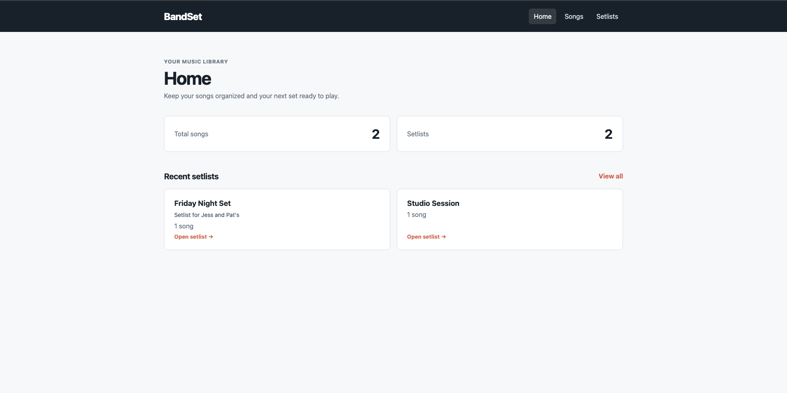
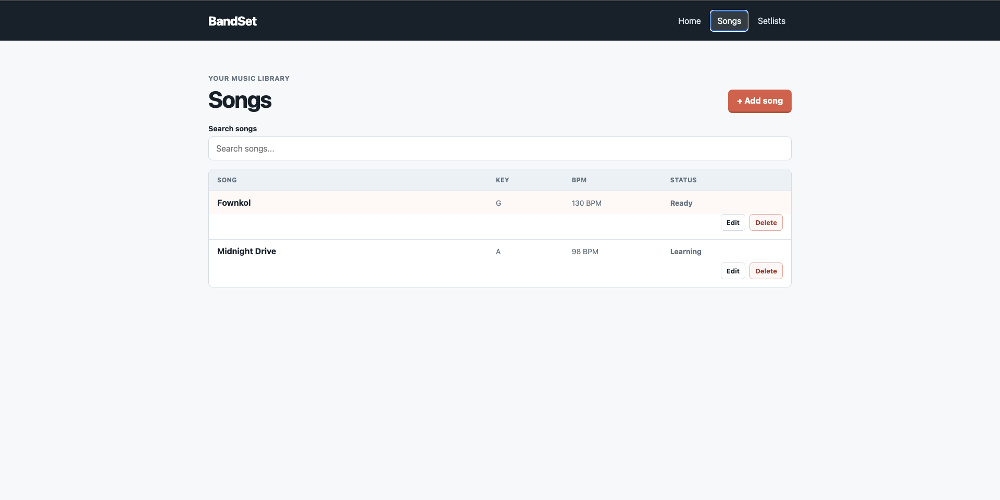
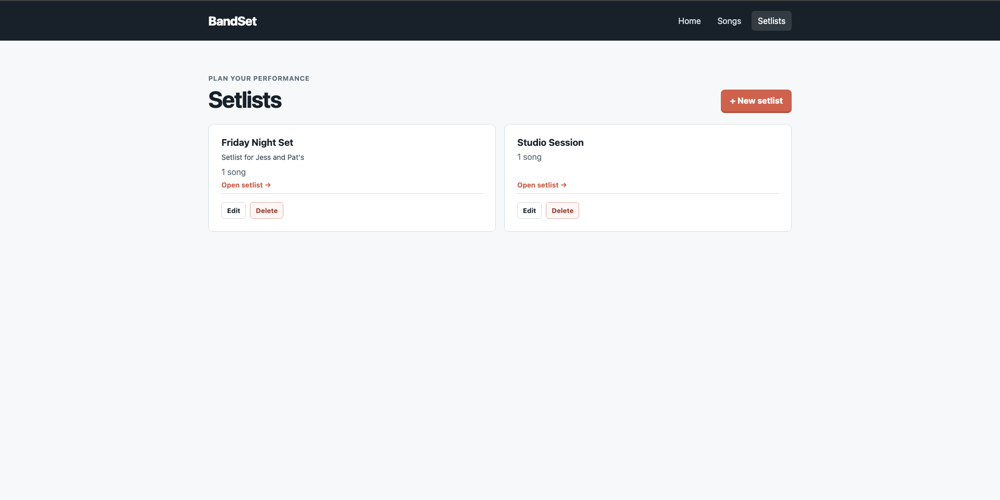
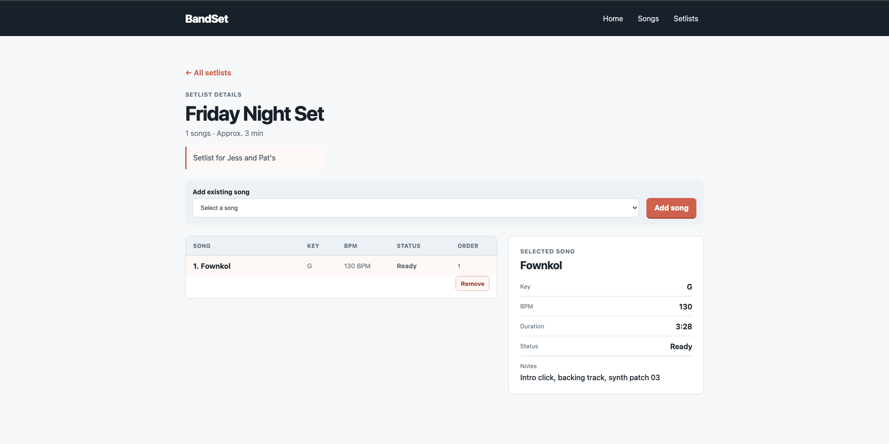

# BandSet

[](AI-USAGE.md)

> **AI-assisted project:** I used OpenAI Codex extensively for syntax support, scaffolding, debugging, and documentation. I designed the application logic and database relationships, reviewed and tested the work, and recorded the collaboration in [AI-USAGE.md](AI-USAGE.md).

BandSet is a responsive web app for musicians who want to keep a small song library and organize songs into setlists. It gives a band member a simple home view, searchable song list, setlist planner, and a focused screen for reviewing the details of a selected song.

## Setup and installation

You will need Node.js 18 or later, npm, Git, and PostgreSQL access. BandSet uses a Supabase-hosted PostgreSQL database.

```bash
git clone https://github.com/jabezapilado/BandSet.git
cd BandSet
npm install
```

### Environment and database setup

Copy the environment example and replace the placeholder database connection string with your own Supabase PostgreSQL connection string. Do not commit the completed `.env` file.

```bash
cp .env.example .env
```

```env
PORT=3001
DB_SSL=true
DATABASE_URL=postgresql://postgres:<password>@<host>:5432/postgres
```

The hosted BandSet project already has these tables and sample records. For a fresh database, run:

```bash
psql "$DATABASE_URL" -f db/schema.sql
psql "$DATABASE_URL" -f db/seed.sql
```

The React frontend requests data from the API. It will show an error until the backend is running with a valid local `.env` database connection.

## Run the app

```bash
npm run dev
```

Open the local address Vite prints in the terminal (normally `http://localhost:5173`). You should see the BandSet home screen with song and setlist totals.

To start the backend API in a second terminal:

```bash
npm run server
```

The API starts at `http://localhost:3001`. You can confirm it is running by opening `http://localhost:3001/api/health`, which returns `{"status":"ok"}`.

## Features and usage

- **Home:** See the current number of songs and setlists, plus quick links to recent setlists.
- **Songs:** Search the song library and use **Add song** to save a song through the API.
- **Song management:** Edit or delete a song. Deleting it also removes it from any setlists that contain it.
- **Setlists:** View all setlists, create one with an optional description, or select one to open it.
- **Setlist management:** Rename, describe, or delete a setlist; add songs to it; and remove individual songs while keeping the remaining order correct.
- **Setlist details:** Review a setlist description and its songs, select a song, and read its key, tempo, duration, status, and notes.
- **Responsive layout:** At phone width, cards and song rows stack vertically and navigation becomes a simple menu.
- **REST API:** The Express server exposes validated song and setlist routes backed by PostgreSQL.

### Main workflow

1. Open **Songs** to add a song or search, edit, or delete an existing one.
2. Open **Setlists** to create a setlist or select one.
3. From **Setlist Details**, add an existing song. Select **Remove** to take it out while keeping the other songs in order.
4. Refresh the browser after a change to confirm it was saved in PostgreSQL.

### API routes

| Method   | Path                              | Purpose                                                     |
| -------- | --------------------------------- | ----------------------------------------------------------- |
| `GET`    | `/api/health`                     | Confirms that the API server is running.                    |
| `GET`    | `/api/songs`                      | Returns all songs.                                          |
| `POST`   | `/api/songs`                      | Creates a validated song.                                   |
| `PUT`    | `/api/songs/:id`                  | Updates a validated song.                                   |
| `DELETE` | `/api/songs/:id`                  | Deletes a song and its setlist entries.                     |
| `GET`    | `/api/setlists`                   | Returns all setlists and song counts.                       |
| `POST`   | `/api/setlists`                   | Creates a validated setlist.                                |
| `PUT`    | `/api/setlists/:id`               | Updates a validated setlist title and optional description. |
| `DELETE` | `/api/setlists/:id`               | Deletes a setlist and its song entries.                     |
| `GET`    | `/api/setlists/:id`               | Returns one setlist with its ordered songs.                 |
| `POST`   | `/api/setlists/:id/songs`         | Adds an existing song to a setlist at the next position.    |
| `DELETE` | `/api/setlists/:id/songs/:songId` | Removes a song and closes the position gap.                 |

## Project structure

```text
BandSet/
├── src/
│   ├── App.jsx          # Screens, components, and API-driven interactions
│   ├── api.js           # Browser requests to the Express API
│   ├── main.jsx         # React entry point
│   └── styles.css       # Design tokens and responsive styles
├── server/
│   ├── app.js           # Express routes and error handling
│   ├── db.js            # PostgreSQL connection pool
│   ├── index.js         # API server entry point
│   └── validation.js    # Server-side input validation
├── db/
│   ├── schema.sql       # Songs, setlists, and setlist_songs tables
│   └── seed.sql         # Invented development data
├── api/                 # Vercel Function entry points for API routes
├── test/
│   └── validation.test.js
├── .env.example
├── index.html
├── package.json
├── middleware.js         # Vercel-wide HTTP Basic Authentication gate
├── README.md
├── REPORT.md
└── AI-USAGE.md
```

## Screenshots

### Home screen



### Songs screen



### Setlists screen



### Setlist details screen



## Deployment

BandSet is configured for deployment on Vercel. The Vite frontend is served as static files and the files in `api/` expose the Express API as Vercel Functions, including nested setlist routes.

In the Vercel project settings, add these **Production** environment variables:

```env
DATABASE_URL=your_private_supabase_session_pooler_connection_string
DB_SSL=true
ACCESS_USERNAME=your_private_username
ACCESS_PASSWORD=your_private_password
```

The deployed app uses HTTP Basic Authentication. Store its username and password only in Vercel and in the private workspace repository where the instructor can access them. Do not add the local `.env` file to Git and do not use the `VITE_` prefix for any server-side secret; browser-visible Vite variables are included in the frontend build.

## Known issues and next steps

- You must add your private Supabase connection string to a local `.env` file before starting the backend. It must never be committed.
- The deployment uses a shared HTTP Basic Auth gate for grading access. It is not a multi-user account system.
- A limited production database role is still recommended before a public production release.

## BandSet grading access

Live app: https://bandset.vercel.app/

Username: root
Password: root1234
